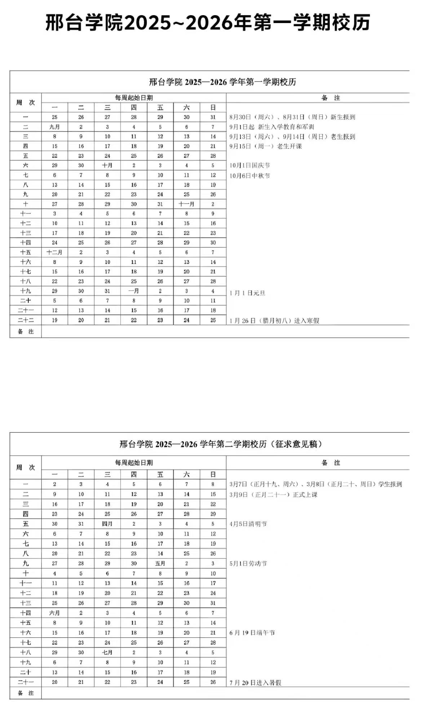
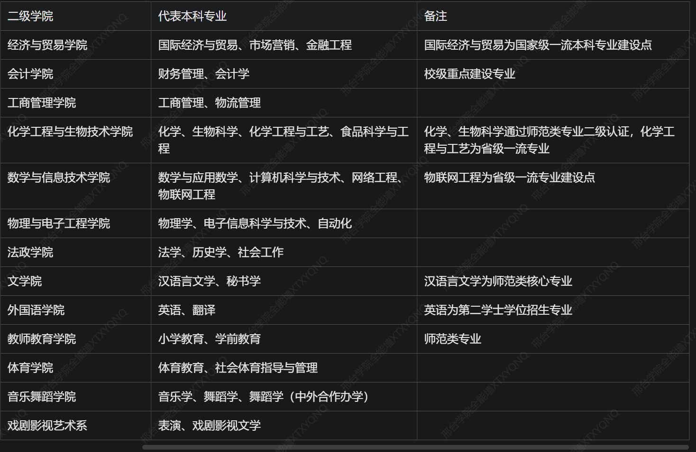

# 困助学
国家和学校为了让学生能够顺利完成学业，制定了一系列政策，落实了一系列措施。我校现行的助学政策和措施主要包括:助学贷款、贫困生补助、临时救助、勤工助学等。
相比于校园地贷款，学生通常办理生源地贷款，故本文对生源地贷款做较为详细的解读，如有与国家、学校政策不一致的地方，以国家、学校的政策为准。
我校在寄给学生的《录取通知书》中附带了助学相关的材料，有需要的同学要仔细阅读。
# 第一部分 助学
邢台学院建立了完善的 “奖、助、贷、勤、补、免” 资助体系，确保家庭经济困难学生顺利入学：
### 入学绿色通道
对被录取的经济困难新生，一律先办理入学手续，再根据核实情况予以资助；报到现场设有专门接待点，可提交《家庭经济困难学生认定申请表》申请缓缴学费
### 主要资助项目
1. 生源地信用助学贷款
    由户籍所在地县级学生资助管理中心办理，承办机构为国家开发银行或当地农村信用社；在校期间利息由财政全额补贴，本专科生每年最高可贷 12000 元。
    汇款账号：开户名邢台学院，开户行建行邢台市桥东支行，账号 1300 1655 1080 5050 5145，汇款需注明学生姓名、录取通知书编号、专业。
2. 奖助学金
    国家奖学金 8000 元 / 年、国家励志奖学金 5000 元 / 年；
    国家助学金平均 3300 元 / 年，分档发放；
    学校设有校级奖学金、单项奖学金等多种奖励。
3. 其他帮扶
    校内勤工助学岗位，按月发放劳务报酬；
    校园无息救急贷：为临时突发经济困难的学生提供小额无息短期借款；
    河北省内建档立卡、低保、特困救助供养等家庭学生，可享受相应学费减免、一次性入学救助（2000-3000 元）

# 快递介绍
### 学校收件地址
主校区：河北省邢台市襄都区泉北东大街 88 号邢台学院，邮编 054001。
### 校内及周边快递点分布
学校快递点覆盖主流快递品牌，主要分布在以下区域：
1. 南区附近：设有邮政、顺丰快递点，靠近南区宿舍楼，取件便利。
2. 北门周边：北门对面设有菜鸟驿站，覆盖中通、圆通、申通、韵达等多数快递，是最主要的快递取件点。
3. 校内其他点位：实训楼附近设有妈妈驿站等快递点，覆盖部分快递品牌；部分快递可送至宿舍楼下或门卫处暂存。
4. 提示：开学季快递量较大，建议错峰寄件；贵重物品建议保价，收件后及时核对包裹完好度。

# 详细尺寸与分部
### 一、核心尺寸标准
全校宿舍床铺统一规格为 宽 0.9m × 长 2.0m，新生购置床上用品可直接参照此尺寸：
上床下桌户型：桌面宽约 0.6m、长约 1.2m，下方带抽屉与键盘托；独立衣柜高约 1.8m、宽约 0.6m、深约 0.5m，可悬挂衣物、收纳大件物品。
上下铺户型：每人配备 1-2 个公共储物柜，单柜尺寸约宽 0.4m× 高 0.6m× 深 0.5m；墙面设公共长桌，可供多人同时学习使用。
### 二、各园区分布与特点
1. 南区宿舍
    位于校园南部，紧邻南门、第一食堂与主教学楼，上课、就餐步行距离最短。以六人间为主，部分楼栋为八人间，多数带独立阳台与卫生间，周边绿化完善，楼下有便利店、打印店等基础配套。
2. 北区宿舍
    位于校园北部，靠近第二食堂、东西操场与北门，取快递、运动锻炼十分便利。涵盖六人间与四人间户型，楼栋建成时间较晚，设施维护状况更好，部分楼栋每层设有小型公共自习区。
3. 金桥公寓
    位于校园东侧，是学校条件较好的住宿片区，以四人间上床下桌为主，标配独立卫浴、阳台，空间宽敞，部分楼栋配备电梯，多为女生宿舍或部分院系高年级学生入住。
4. 培英园、学军园、择业园
    分散在校园中西部，以六人间、八人间为主，紧邻各院系教学楼与图书馆，步行上课通勤时间短，适合日常往返教室与宿舍。

# 空调及电费充值
### 一、空调覆盖与使用规则
目前邢台学院绝大多数学生宿舍已完成空调安装，基本实现全覆盖。空调采用宿舍自愿租赁制：
新生入住后，以宿舍为单位自愿申请开通，需缴纳空调押金（毕业时设备无损坏可全额退还），租金按学年收取，费用由宿舍成员平摊。
空调用电与宿舍日常照明、插座用电分开计量、单独计费，费用不包含在基础住宿费内。
### 二、电费充值渠道
1. 日常照明 / 插座电费
    学校每月为每间宿舍提供固定额度的免费基础用电，超出部分由宿舍成员均摊。可通过校园内的一卡通圈存机、“邢台学院” 官方微信公众号的校园服务板块充值，电费实时到账。
2. 空调电费
    采用独立预付费系统，需通过专属微信小程序扫码充值，输入对应宿舍号即可缴费，余额不足时空调将自动断电。
提示：开学入住后可先查看电表余额，及时充值避免断电；寒暑假离校前建议关闭空调总闸，防止异常扣费。

# 门禁、热水
### 一、宿舍门禁管理
门禁时间：宿舍楼大门统一开放时段为 6:00—22:30，22:30 后关闭大门，禁止人员随意进出。
晚归处理：因特殊情况晚归的学生，需凭学生证或校园卡向宿管人员登记、说明事由后方可进入；多次无故晚归将通报至所在院系，计入日常行为考核。
访客管理：禁止校外人员随意进入宿舍楼，外来访客需在值班室登记，并由学生本人到门口接应，当日 22:00 前必须离开。
### 二、热水供应
1. 洗浴热水
    带独立卫生间的宿舍：热水直通卫生间淋浴头，供应时段一般为 12:00—14:00、17:00—23:00，按流量计费，刷校园卡或扫码出水，费用约 0.2—0.3 元 / 分钟。
    无独立卫浴的宿舍：需前往园区公共澡堂，为隔间式设计，同样刷校园卡计费，开放时间与宿舍热水同步。
引用水全域免费的

# 自助洗衣、寝室报修
### 一、自助洗衣服务
分布：每栋宿舍楼的一层或中间楼层设有公共洗衣房，配备多台滚筒洗衣机，部分楼栋配有烘干机与洗鞋机。
使用方式：全部支持微信、支付宝扫码付费，普通快洗约 3—4 元 / 次，标准洗 5—6 元 / 次，烘干约 8—10 元 / 次。
注意事项：洗衣前请清空口袋物品，避免损坏机器；禁止洗涤鞋子、贴身内衣、大件被褥等物品；洗涤完成后及时取走，避免占用公共机器。
### 二、寝室报修
宿舍内家具、水电、门窗、空调等设施出现故障，可通过两种渠道报修：
1. 线上报修：通过学校后勤处官方公众号或校园服务小程序，填写宿舍号、故障类型、联系方式并上传故障照片，后勤维修人员一般在 1—2 个工作日内上门维修。
2. 线下报修：直接到宿舍楼值班室找宿管人员登记，由宿管统一上报维修组，适合停水、断电、门锁损坏等紧急故障。
提示：正常使用造成的设施损坏维修免费，人为损坏需按价赔偿；报修后尽量保持宿舍有人，或留下联系方式方便维修人员沟通。

# 社团组织
### 校级学生组织
主要包括校学生会、校团委各职能部门、大学生艺术团、青年志愿者协会、广播站、社团联合会等，是学校官方指导的学生组织，负责校园文化建设、学生服务等工作。
### 学生社团
目前全校拥有校级、院级学生社团 80-96 个，注册成员五千余人，覆盖五大类别，年均开展活动百余场
思想政治类：青年马克思主义研究会、红色文化社团等
学术科技类：英语爱好者协会、数学协会、科技创新协会、法律协会等
文化艺术类：吉他协会、街舞社、话剧社、书法协会、动漫协会、古筝乐团等
志愿公益类：青年志愿者协会、爱心社、手语社等
体育健身类：篮球协会、足球协会、羽毛球协会、梅花拳协会、跆拳道协会等

# 校历
考邢台学院近年校历安排，常规学年时间节点如下，每年会结合法定节假日微调，以教务处当年发布的正式校历为准：
- 秋季学期：9 月初新生报到并开展军训，9 月中下旬正式开课；次年 1 月中旬进入期末考试周，1 月底放寒假，寒假时长约 5 周。
- 春季学期：2 月下旬学生返校注册，3 月初正式开课；6 月下旬进入期末考试周，7 月初放暑假，暑假时长约 8 周。
- 关键节点：每学期第 10-11 周为中期考试周，第 18-19 周为期末考试周；校历同步标注运动会、新生军训、百团大战、毕业答辩等全校性活动时间。
- 获取渠道：邢台学院教务处官网、各院系通知栏、迎新系统均可下载查看最新高清校历。、清明、劳动节、端午等假期会按国家统一安排

# 为什么要办电信校园卡？
1. 电信校园卡套餐流量充足，办理即赠送免费校园宽带（宽带需电信校园卡账号登录使用）
2. 教务系统、车辆管理系统、校内各类线上平台，均需连接校园网才可正常登录使用
3. 校内电信 WiFi 免费使用，宿舍配备有线网线接口，上网稳定流畅
4. 可顺畅访问学校采购的各类学术数据库，方便查阅知网等文献资源（也可搭配校园 VPN 使用）
5. 本科教务系统抢课时，校园网 + 电脑对比非校园网手机端优势明显，登录选课系统速度更快、延迟更低、不易卡顿掉线
🧷
TIPS:
覆盖范围
全校教学楼、图书馆、宿舍、食堂、体育馆等全部区域实现电信无线网络全覆盖，每间宿舍同步配备有线网络接口。
校园网：高速稳定电信校园 Wi-Fi，办公楼、教学区全区域覆盖！（网速实际体验会受时段、地点、设备影响略有差异）
划重点：学校不会强制大家办理任意运营商电话卡，无硬性规定！
如果开学有人谎称：不办对应电话卡就没法连校园网、不能选课……
这里说明清楚：校内学习、选课所需校园网，仅支持电信校园卡账号登录；有上网需求随时办理即可。
暑假如何线上办理电信校园卡？
不少新生会遇到开学季学长学姐线下推销，目的性较强容易让人抵触，不想线下周旋的同学可以走校园正规渠道！
校园论坛与中国电信官方合作，渠道正规有保障，无套路隐形消费
有疑问可添加电信小助手微信咨询办理
为什么选择中国电信校园卡？
校园卡套餐：
39 元月租包含 200G 全国通用流量＋200 分钟国内通话＋免费校园宽带
各类视频会员、生活福利等权益活动持续更新上线……
综合评估：
综合 23、24、25 届在校学长学姐真实反馈，校内电信校园卡基站覆盖完善，信号与网速表现最优

# 快递/打印/超市/外卖柜
### 一、快递服务
1. 收件地址：河北省邢台市襄都区泉北东大街 88 号邢台学院，邮编 054001，建议备注清楚院系 + 宿舍园区。
2. 取件点位
    北门菜鸟驿站：位于北门外对面商铺，覆盖中通、圆通、申通、韵达、极兔等主流快递，营业时间 8:00-20:30，开学季会延长服务时间。
    校内南区快递点：靠近南区宿舍，承接邮政 EMS、顺丰快递，部分快递可送达宿舍楼下驿站。
    京东快递：北门旁设有京东快递专属取件点，支持预约送货上门。
3. 提示：开学季快递量极大，建议错峰邮寄行李，贵重物品选择保价寄送。
### 二、打印服务
校内打印店主要分布在南区宿舍旁、主教学楼一层、图书馆一层，支持黑白打印、彩色打印、复印、扫描、证件照打印。
价格：黑白打印 0.1-0.2 元 / 张，彩色打印 1-2 元 / 张，打印量大可议价；支持微信文件直接打印，无需携带 U 盘。
### 三、校内超市
校园内设有多家校园超市，分布在第一食堂旁、第二食堂旁、各宿舍园区楼下，售卖零食、日用品、文具、饮用水等，支持校园卡、微信、支付宝付款。
超市营业时间一般为 7:00-22:30，部分宿舍楼下便利店营业至 23:00，满足日常应急采购需求。
### 四、外卖柜
外卖无法进入宿舍楼，学校南门、北门均设有智能外卖柜，外卖员会将餐品放入柜中，学生凭取件码自取。
部分商家支持送到宿舍园区门口，需自行到园区门口取餐；建议填写地址时备注清楚校门外卖柜，避免餐品丢失。

# 运动场馆
学校运动场地齐全，大部分室外场地免费开放，室内场馆按需预约，可满足日常锻炼与赛事需求。
### 室外场地
1. 东、西田径场：两个标准 400 米塑胶跑道 + 天然草坪足球场，全天免费开放，是跑步、军训、运动会的主要场地，早晚均有学生锻炼。
2. 篮球场：共 20 余片室外篮球场，分布在操场旁、南区宿舍旁，免费开放，课余时间人气较高。
3. 其他室外场地：羽毛球场、排球场、乒乓球台、健身器材区，分散在校园各区域，全部免费使用。
### 室内场馆
- 体育馆：位于校园西北角，内设室内篮球场、羽毛球场、乒乓球室、健身房、形体房。
    - 开放时间：工作日 14:00-21:00，周末 9:00-21:00；
    - 使用规则：羽毛球、乒乓球等场地可通过校园公众号预约，部分项目收取少量费用，学生凭校园卡享受优惠。
- 提示：大型体育赛事、体育课会占用部分场地，使用前可提前查看场地预约状态。

校医院
位置与开放时间：位于校园西南部，靠近南区宿舍；工作日 8:00-17:30 正常开诊，夜间、节假日有值班医生，24 小时接诊急诊。
科室与服务：设有内科、外科、全科门诊、药房、注射室，可处理感冒、发烧、肠胃不适、外伤处理等常见病，提供基础诊疗与药品售卖，收费平价。
就诊流程：携带校园卡、身份证到校医院挂号，医生问诊后开药，支持校园卡、医保结算；病情严重的，医生会开具转诊单建议到校外大医院就诊。
二、大学生医保
参保方式：新生入学后，学校统一组织参加邢台市城乡居民基本医疗保险（大学生医保），保费按当年标准收取，一般每年 300-400 元，自愿参保。
报销规则
校内门诊：在校医院就诊，医保范围内药品、诊疗项目可报销 50%-70%，直接刷医保结算；
校外门诊：需校医院开具转诊单，到指定医院就诊，按比例报销；
住院：在邢台市定点医院住院，按城乡居民医保政策报销，比例约 60%-80%。
提示：入学后请及时关注医保参保通知，按时缴费，避免影响医保待遇。
初入校园，大家会有许多问题吧，比如奖学金怎么评选？退教材什么流程？医保怎么使用？怎样才能报销......而医保与同学们生活密切相关，同时也是不少同学所疑惑的，今天，小编利用本就不多的课余时间结合自身经历吐血整理了这份医保使用指南，记得收藏好哦！
目录

## 什么是大学生医保？
医保介绍<<<<
大学生医保，全称为大学生医疗保险，属于城镇居民医保范畴。是由参保学生个人缴纳的基本医疗保险费和国家补助两部分组成。大学生医保的缴费时间集中在每年的9月1日至12月31日，一年缴一次，一次管一年。大学生医保的保障范围包括普通门诊、门诊慢性病、门急诊、门诊特殊疾病、住院及生育补贴。简单点说，大学生医保就是买学校当地的城乡居民医保。所以，咱们学费中360元的学费，就是我们个人缴纳的四年保险费用。

## 如何使用大学生医保?
1.起伏线
当每年自费累计达到300元的起伏线后，超出300元的部分才根据比例进行医保报销。
2.转诊
但如果从校医务室转诊，就可以免除门诊起伏线300，即即使你没有累计支付300元，也是按照比例进医保的。
如何转诊？校医务室在学校东北门附近，进入医务室后找一个有医生在的房间，跟他说你要看的病+要去的医院，在二维码扫描口处扫描自己的医保二维码，即转诊成功。
3.如何打开大学生医保？
1）打开“支付宝”，点击首页中“医疗健康”， 点击左上角“电子医保凭证”，将参保地选择为地区，使用时（挂号、支付）将二维码对准医院的扫码口就可以了。
2）部分杭州本地同学是有社会保障卡的，使用时直接刷卡即可。
注意：大学生医保是国家统筹基金支付，并没有个人账户，也就是说，里面是没有钱的，刷完二维码之后，仍然要自己支付一部分费用！但这一部分费用，是原本的治疗费用-国家统筹基金支付的费用。

# 图书馆
邢台学院图书馆位于校园中部核心区域，是学校的文献信息中心，馆藏资源丰富，是日常自习、查阅资料的主要场所。
### 一、开放时间
借阅区、自习室：工作日 8:00-22:00，周末 9:00-22:00；
电子阅览室、特藏室：工作日 8:00-11:40，14:00-17:30；
节假日、寒暑假会调整开放时间，以图书馆官方通知为准。
### 二、借阅规则
1. 入馆方式：刷本人校园卡入馆，一人一卡，禁止代刷。
2. 借阅权限：本科生凭校园卡可借阅图书 10-15 册，借期 30 天，可续借 1 次（续借 30 天）；逾期未还会收取少量滞纳金，且暂停借阅权限。
3. 续借方式：可通过图书馆官网、官方公众号、自助借还机办理续借。
### 三、资源与服务
馆藏：馆藏纸质图书百万余册，涵盖文、理、工、经、管等各学科，设有专业图书区、文学区、期刊报纸区。
电子资源：购买了中国知网、万方、维普等数据库，校园网内可免费下载文献、论文。
自习服务：馆内设有多个自习室、考研自习区，座位充足；考试季可通过公众号预约座位，规范占座问题。
其他：设有自助借还机、自助打印机、饮水处，定期举办读书讲座、书友活动

# 奖学金/助学金
学校建立了完善的奖助体系，覆盖优秀学生与家庭经济困难学生，具体名额、金额以当年官方通知为准。
### 一、奖学金（按成绩与综合表现评定）
1. 国家级奖学金
    国家奖学金：8000 元 / 年，面向全校优秀学生，名额极少，需专业排名前 1% 且综合表现突出。
    国家励志奖学金：5000 元 / 年，面向家庭经济困难且成绩优秀的学生，覆盖率约 3%-5%。
2. 校级奖学金
    校级一等奖学金：约 1000-2000 元 / 年；
    校级二等奖学金：约 500-1000 元 / 年；
    校级三等奖学金：约 300-500 元 / 年；
        按综测排名评定，整体覆盖率约 20%-30%。
3. 其他专项奖学金：企业奖学金、单项奖学金（学习进步、文体竞赛、科研创新等），金额从几百到几千元不等。
### 二、助学金（面向家庭经济困难学生）
1. 国家助学金：分为三档，平均 3300 元 / 年，一档 4400 元、二档 3300 元、三档 2200 元，覆盖率约 20%，按家庭困难程度评定。
2. 校级助学金：针对特殊困难学生的临时补助、伙食补贴。
3. 勤工助学：校内设有图书馆、行政助理、实验室助理等勤工助学岗位，按月发放劳务报酬，约 300-500 元 / 月，优先安排家庭经济困难学生。

# 行政办事
校内主要行政部门职能与办事地点如下，工作日上班时间一般为 8:00-11:40，14:00-17:30，节假日休息。
1. 教务处
    位置：主行政楼内；
    职能：学籍管理、选课调课、成绩管理、考试安排、毕业审核、证明打印、四六级报名等。
2. 学生处（学生工作部）
    位置：学生活动中心或行政楼；
    职能：奖助学金评定、助学贷款、学生管理、心理咨询、征兵、学生证补办等。
3. 财务处
    位置：行政楼；
    职能：学费住宿费缴纳、发票开具、奖助学金发放、退费办理等。
4. 后勤管理处
    位置：后勤楼；
    职能：宿舍报修、水电服务、食堂管理、校园环境维护、空调租赁。
5. 保卫处
    位置：南门旁保卫楼；
    职能：校园安全、门禁管理、户籍迁移、失物招领、案件报警。
6. 线上办事：学校官网设有 “网上办事大厅”，部分业务可线上提交申请，无需跑现场。

# 周边生活
邢台学院位于邢台市区东北部，交通便利，周边生活配套齐全：
### 交通出行
校门口有公交站，途经 1 路、20 路、22 路、30 路等多条公交线路，可直达火车站、汽车站、万达广场、市中心等区域，票价 2 元。
打车到邢台东站（高铁站）约 20 分钟，到邢台火车站约 15 分钟，北门、南门均可正常上下车。
### 购物餐饮
周边商圈：距离万达广场约 3 公里，是大型综合商场，购物、餐饮、影院齐全；世贸天街、天一城商圈打车 10-15 分钟可达。
日常购物：北门、南门外有多家连锁超市、便利店、水果店，满足日常采购；北门有小吃街，各类餐饮、奶茶店丰富，价格亲民。
### 医疗与生活
周边医院：邢台市人民医院、邢台医专第二附属医院，均为三甲医院，打车 10-15 分钟可达，适合处理重症与复杂病症。
银行网点：校内有建设银行 ATM，周边有建行、工行、农行、中国银行网点，办理银行业务方便。

学生证优惠
今天小助手为大家带来——
【学生证优惠指南】
学会使用大学生优惠来薅羊毛
一年省下一个“亿”
不是问题！
一
学生认证

首先打开支付宝进行学生验证：
二
吃喝优惠福利
1. 海底捞69折
在支付宝上认证学生信息后
学生可根据不同用餐时间段
享受6.9折或8.8折优惠
需要注意的是：大学新生入学后需在校3个月后
才可以进行学生身份认证哦！
6.9折时间段：
周一至周五14:00-17:00;22:00-次日7:00
周六、周日0:00-7:00
8.8折时间段:
全时段可用
ps：春节期间优惠时段可能有所调整
详情请移步海底捞小程序查看哦～

2. 麦当劳&肯德基&必胜客
开学季或某些时间段
会推出学生季节优惠价格
同学们可以蹲一波优惠
最低有6.3折优惠～
支付宝搜【学生价】有9.9元大神卡
多种商品均有折扣!
必胜客凭学生证
工作日可享8折优惠，周六周日8.8折！

3. 奶茶咖啡
瑞幸咖啡9.9元
奈雪的茶8.8折
书亦双倍优惠，随心享～
许多奶茶咖啡连锁店
都有校园活动专区
权益多多！
上课、刷夜都可以奖励自己一杯
提神醒脑抗疲劳！
东湖校区瑞幸咖啡地点：
西径食堂2楼，南门学4和学3之间
三
各大景区

多地景区的票务政策中
均有提及凭学生证
可享受一定程度的优惠
各种各样的博物馆、科技馆
日常凭学生证
可有五折至七折的优惠
ps：具体可在飞猪、携程、美团等app上查看
不要买贵了！
出门游玩记得随身携带学生证哦～
还有各大游乐园
可以多多关注学生优惠
淡季游玩真的很香！
全国大部分的知名旅游景点
都可以凭学生证半价优惠
4A5A任你挑选 ！
四
影视演出

支付宝完成学生验证
即可享受“淘票票”优惠
部分电影院、KTV、大剧院
也是接受直接出示学生证的哟～
记得提前做好攻略！
部分视频软件会员
也可享受学生优惠～
可在淘宝搜索爱奇艺学生会员
年卡至少立省50元
爱追剧的家人不要错过呀！

五
出行

火车、高铁：
1）每年可购买四次
从家到学校的往返火车票
学生凭优惠卡可以购买
硬座、硬卧的半价火车票
2）学生半价票只是硬座票的半价
如果学生要购买卧铺票
其硬座部分可享受半价
其卧铺部分则按全价计算
任何车次的软座、软卧火车票都无半价
3）动车组列车只对学生出售
二等车厢学生车票
票价为全价的7.5折
一等车厢不卖学生票

铁路12306 还推出了
春运期间学生、务工人员
专区预约购票
用于购买春运期间往返火车票
通过学生资质核验的同学
可以打开铁路12306手机app
点击学生务工预约（仅限本人）
根据指引预约车次及座席
预约完成后等待车票兑现
在车票成功兑现后支付票款即可
可以大大提升抢到票的几率哦！

许多打车平台
如滴滴出行的学生专属优惠
如哈啰单车的6.5元、
无限次数的单车月卡～
妈妈再也不用担心通勤太贵啦！
六

Apple在不同国家和地区
均有教育优惠和暑期返校季优惠
大家可以在学校所在地的
Apple官网或AppleStore零售店
使用学生优惠购买Apple设备
（如平板或电脑）
赠送一副AirPods或享受价格优惠哦！
对了！
还有apple music
同样有学生专属优惠～
每月仅需6元！

除此之外：
许多店面出示学生证
都是可以打折的喔
具体详情可以咨询店家~
1.大型连锁理发店
2.支付宝
(学生证专享福利和芝麻信用）
3.京东、淘宝
(学生特价和大学生专属优惠券）
4.酒店住宿
（如家酒店，可领取青春会员卡）
可享订房优惠
并且退房时间
可以延时至第二天下午三点～
以上就是小助手整理的大学生优惠攻略啦！
让我们学会薅羊毛
把钱花在刀刃上~
如果你还知道什么隐藏福利
欢迎补充哦

#  租赁缴费
校内主要租赁项目与各类费用缴纳渠道如下：
### 一、空调租赁
办理方式：新生入住后，以宿舍为单位自愿申请，到后勤处或宿舍楼下服务点办理，签订租赁协议。
费用标准：押金约 300-500 元 / 台（毕业无损坏全额退还），年租金约 300-400 元 / 台，由宿舍成员平摊。
缴费方式：现场扫码支付或校园卡支付，空调电费单独计量、单独充值，与日常电费分开计费。
### 二、其他租赁
军训服：新生报到时可购买或租赁军训服，租赁需缴纳押金，军训结束后归还无损坏退还押金。
体育器材：体育馆可租赁羽毛球拍、篮球、乒乓球拍等，凭校园卡抵押，按时归还即可。
### 三、常规缴费渠道
1. 学费、住宿费：每年秋季开学前，通过学校官网财务平台、建设银行代扣缴纳，也可报到时到财务处现场缴费。
2. 水电费：基础电费免费额度内无需缴费，超额部分通过校园卡、公众号充值；水费一般包含在住宿费内，热水、直饮水单独计费。
3. 其他费用：医保费、四六级报名费、重修费等，均通过学校指定的线上平台缴纳，不接受私人转账。

# 转专业
### 申请条件
大一第一学期平均绩点≥2.5（热门专业≥3.0）
无挂科记录，无校纪处分
身体条件符合转入专业体检、素养要求
每位学生在校本科阶段仅限转一次专业
申请时间
大一第一学期末（12 月）、大一第二学期末（6 月）各开放一次转专业申报通道
转专业流程
学生向当前就读学院提交纸质转专业申请表
原就读学院初审签字、审核同意
目标转入学院组织专业笔试 + 综合面试考核
教务处统一复核审批并全校公示名单
公示无异议后，统一办理学籍、班级、培养方案变更手续
热门转专业方向
计算机科学与技术、会计学、法学、汉语言文学、电气工程及其自动化、小学教育
注意：艺术、体育类专业有专业加试；师范类、医学相关专业有分数与身体限制，部分跨大类转专业考核难度更高

# 院系专业/校区
### 校区概况
邢台学院为单主校区办学，地址位于河北省邢台市襄都区泉北东大街 88 号，所有本科专业均在主校区培养，无分校区。校园功能分区清晰，教学区、宿舍区、运动区、后勤服务区集中分布，日常通勤便捷。
### 主要二级学院与核心专业
学校现有 20 余个二级学院（系、部），开设 54 个本科专业，覆盖文学、理学、工学、经济学、管理学、法学、历史学、教育学、艺术学 9 大学科门类，核心院系及代表专业如下：

# 材订购
### 订购规则
1. 新生第一学期：学校按招生计划统一征订全套教材，报到后以班级为单位统一发放，教材费按实际定价结算，多退少补。
2. 老生学期：实行自愿选购原则，不强制统一购买。学生可根据教务处公布的教材清单，自主选择购买渠道。
### 购买渠道
1. 官方渠道：通过学校教材科统一订购，为正版教材，版本与教学大纲完全匹配，适合需要全新教材的学生。
2. 二手教材：可通过校内二手群、毕业季跳蚤市场、学长学姐处购买，价格为原价的 1-3 折，注意核对教材版本、作者、出版社，避免买错。
3. 线上渠道：淘宝、京东、拼多多等平台购买，价格优惠，部分课程可使用电子版教材（需提前征得任课老师同意）。
### 注意事项
核心专业课、有配套习题 / 代码的课程建议购买正版实体书；通识类、理论类课程可酌情使用二手书或电子版。
教材版本以每学期教务处公布的《课程教材选用表》为准，避免因版本差异影响学习。

# 辅修/双学位/第二学位
### 一、辅修与双学士学位（在校本科生）
1. 培养定位
    面向学有余力的全日制本科在校生，跨学科门类修读另一专业，达到要求可获得辅修专业证书，符合学位授予条件的，颁发双学士学位证书。
2. 报名条件
    全日制二年级本科生，无纪律处分、无挂科补考记录；
    主修专业必修课程平均成绩 75 分以上；
    必须跨学科门类报考（如工学专业修读管理学学位）。
3. 开设专业
    常年开设国际经济与贸易、工商管理、会计学等双学位专业，招生名额约各专业 100 人 / 年，具体以当年教务处通知为准。
4. 学习安排
    利用晚上、周末、寒暑假集中授课，学制与主修专业同步，大四前完成全部课程与考核。
### 二、第二学士学位（本科毕业生）
1. 定位：面向已获得学士学位的本科毕业生，全日制攻读第二专业，学制 2 年，毕业颁发第二学士学位毕业证与学位证。
2. 招生专业：2025 年开设英语专业，招生 50 人，学费 4900 元 / 年。
3. 报考条件：本校近 3 届未就业、未升学的本科毕业生，且已获得学士学位。

# 第二课堂
### 制度说明
第二课堂是本科生必修环节，与第一课堂（专业课程）共同构成人才培养体系，参与课外活动、竞赛、志愿、科研等均可获得对应学分，未修满要求学分无法毕业。
### 管理平台
学校使用到梦空间系统作为第二课堂官方管理平台，活动发布、报名、签到、学分认定全流程线上完成，账号为学号，初始密码统一设置。
### 学分要求与模块分类
毕业要求：普通本科生在校期间需修满2 学分（对应 10 个成长积分，5 积分 = 1 学分），分思想政治、志愿公益、创新创业、文体活动、技能特长等模块。
主要获取途径：
    1. 思想成长类：参加党团校、主题教育活动、学术讲座；
    2. 志愿公益类：参与校园志愿服务、三下乡、社区实践；
    3. 创新创业类：参加学科竞赛、大创项目、创业讲座；
    4. 文体活动类：加入社团、参加校园文体赛事、文艺演出；
    5. 工作履历类：担任学生干部、社团负责人。

# 选课/选修课
### 课程类型
1. 公共选修课（通识选修课）：全校各专业学生均可选修，用于拓宽知识面、凑毕业学分，分为人文社科、自然科学、艺术美育等类别。
    毕业要求：2024 级、2025 级需修满9.5 学分，其中必须包含2 学分公共艺术课程（美育要求）。
2. 专业选修课：本专业内的方向课程，用于深化专业技能，需在本专业培养方案要求的模块内选修，修满规定学分即可。
### 选课流程
选课分三个阶段，通过教务管理系统操作：
1. 预选阶段：每学期期末开放，学生填报志愿，系统按志愿优先级抽签，热门课程存在落选可能。
2. 正选阶段：预选结果公布后，落选学生可选择剩余有名额的课程，先到先得。
3. 补退选阶段：开学前 2 周开放，可退选已选课程、补选未满课程；开学后一般不再允许退课。
### 选课注意事项
每学期修读课程总学分原则上不超过 40 学分，避免课业过载。
通识网课主要在超星尔雅（学习通）、智慧树（知到）平台学习，需按时完成视频、作业与期末考试。
不可重复修读已获得学分的课程，重复修读不计入学分。

#  转专业
### 申请条件
大一第一学期平均绩点≥2.5（热门专业≥3.0）
无挂科记录，无校纪处分
身体条件符合转入专业体检、素养要求
每位学生在校本科阶段仅限转一次专业
申请时间
大一第一学期末（12 月）、大一第二学期末（6 月）各开放一次转专业申报通道
转专业流程
学生向当前就读学院提交纸质转专业申请表
原就读学院初审签字、审核同意
目标转入学院组织专业笔试 + 综合面试考核
教务处统一复核审批并全校公示名单
公示无异议后，统一办理学籍、班级、培养方案变更手续
热门转专业方向
计算机科学与技术、会计学、法学、汉语言文学、电气工程及其自动化、小学教育
注意：艺术、体育类专业有专业加试；师范类、医学相关专业有分数与身体限制，部分跨大类转专业考核难度更高

# 成绩/绩点算法
### 一、百分制成绩与绩点对应规则
学校采用5 分制绩点体系，百分制成绩直接折算绩点，具体对应关系：
100 分 = 5.0 绩点
90-99 分 = 4.0-4.9 绩点（每 1 分对应 0.1 绩点）
80-89 分 = 3.0-3.9 绩点
70-79 分 = 2.0-2.9 绩点
60-69 分 = 1.0-1.9 绩点
60 分以下 = 0 绩点
五级制成绩对应绩点：优秀 = 4.5，良好 = 3.5，中等 = 2.5，及格 = 1.5，不及格 = 0。
### 二、平均学分绩点（GPA）计算公式
平均学分绩点为加权计算，学分越高的课程对绩点影响越大，公式为：
平均学分绩点=∑所有课程学分∑(单门课程绩点×该课程学分)​
### 三、特殊成绩的绩点规则
补考及格：成绩按 60 分记载，对应绩点 1.0，标注 “补考”。
重修及格：按实际考试得分计算绩点，成绩单标注 “重修”。
缓考：与正常考试同等效力，按实际得分计算绩点，无特殊标注。

# 补考、缓考、重修等相关
### 补考
适用范围：期末考试不及格（低于 60 分）的课程，且无缺考、违纪情况。
时间安排：新学期开学后第 1-2 周进行，具体时间由教务处统一公布。
成绩规则：补考及格统一按 60 分记载，获得对应学分，但绩点仅计 1.0；补考不及格必须参加重修。
报名方式：无需单独报名，系统自动为不及格学生生成补考名单。
### 缓考
适用条件：因病住院、直系亲属重大变故等特殊原因无法参加期末考试，需提前提交书面申请与县级以上医院证明，经院系、教务处审批通过。
时间安排：与开学初补考同步进行。
成绩规则：按实际考试得分记录，正常计算绩点，与正常考试完全等效。
注意：未申请缓考或申请未通过而缺考，按 “旷考” 处理，成绩记 0 分，无补考资格，只能重修。
### 重修
适用范围：补考不及格、旷考、考试违纪取消成绩的课程。
报名方式：每学期选课期间，在教务系统选择对应课程的重修班，跟随下一年级学生上课、考试。
费用与学分：需按学分缴纳重修费，具体标准以学校当年通知为准；考试及格后获得对应学分，成绩按实际得分记载，标注 “重修”。
重要提示：学校已取消毕业前 “清考” 制度，所有未通过课程必须通过重修合格，否则无法毕业。

# 体育体测
### 测试项目
执行《国家学生体质健康标准》，本科全员每年测试一次，共 8 个项目：
必测项：身高 / 体重（BMI）、肺活量
男生：50 米跑、坐位体前屈、立定跳远、引体向上、1000 米跑
女生：50 米跑、坐位体前屈、立定跳远、1 分钟仰卧起坐、800 米跑
### 测试安排
测试时间：每年 10-12 月集中开展，由体育学院统一组织，按院系分批次进行。
补测安排：首次测试不及格的学生，次学期安排一次补测机会。
### 评分与毕业要求
单项指标按权重计算总分，满分为 100 分，90 分以上为优秀，80-89 为良好，60-79 为及格，60 以下为不及格。
毕业成绩核算：毕业当年体测成绩占 50%，前三年体测平均分占 50%。
毕业要求：毕业体测综合成绩达到 50 分以上方可毕业；因病、残疾的学生可提交医院证明，申请免予执行体测标准，经审批后不影响毕业
体测成绩与评优评先、奖学金评定直接挂钩，不及格者取消当年评奖资格。
## 测试项目与评分标准
测试项目：身高、体重、视力、肺活量、立定跳远、坐位体前屈、50 米跑、一分钟仰卧起坐（女）/引体向上（男）、800 米跑（女）/1000 米跑（男）。
学年测试总分由标准分与附加分之和构成，满分为120 分。标准分由各单项指标得分与权重乘积之和组成，满分为100 分。附加分根据实测成绩确定，大学生的加分指标为男生引体向上和 1000 米跑，女生 1 分钟仰卧起坐和 800 米跑，各指标加分幅度均为 10 分。（具体评分标准见附表）
## 等级评定与成绩登记
90.0 分及以上为优秀，80.0～89.9 分为良好，60.0～79.9 分为及格，59.9 分及以下为不及格。学生测试成
绩评定达到良好及以上者，方可参加评优与评奖；成绩达到优秀者，方可获体育奖学分。测试成绩评定不及格者，在本学年度准予补测一次，补测仍不及格，则学年成绩评定为不及格
## 缓测与补测
学生因病或残疾可向学校提交暂缓或免予执行《标准》的申请，经医疗单位证明，体育军训部核准，可暂缓或免予执行《标准》，并填写《免予执行<国家学生体质健康标准>申请表》，存入学生档案。确实丧失运动能力、被免予执行《标准》的残疾学生，仍可参加评优与评奖，毕业时《标准》成绩需注明免测。

# 智慧校园与教务系统
### 智慧校园统一信息门户
入口：http://i.xttc.edu.cn
功能：统一身份认证，一站式对接教务系统、学工系统、图书馆系统、一卡通、OA 办公、科研系统等所有校内平台，一次登录即可访问全部应用。
### 2. 教务管理系统
入口：学校官网→教务处→高校教学综合管理服务平台
核心功能：选课、退课、课表查询、成绩查询、培养方案查看、考试报名、缓考申请、学籍信息维护，是学业相关的核心系统。
### 3. 今日校园 APP
移动端核心工具，对接校内所有系统，核心功能包括：
    学业类：查课表、查成绩、考试安排、空教室查询；
    生活类：校园卡充值、电费缴费、宿舍报修、图书馆座位预约；
    办事类：请假申请、证明开具、奖助学金申请、活动报名。
### 4. 网络教学平台
超星泛雅（学习通）、长江雨课堂、学堂在线等，用于网课学习、课堂签到、作业提交、线上考试。

# 科研竞赛
### 一、校级科研平台
学校拥有多个省级、市级科研平台，面向本科生开放参与：
省级平台：河北省数字化淡水水产养殖技术重点实验室、河北省煤化工与分析技术实验教学示范中心、教育部绿色化工虚拟仿真创新实验中心等；
院士工作站、校企联合研发中心多个，覆盖化工、材料、生物、经济等学科。
### 二、主流学生竞赛
1. 综合类竞赛：“挑战杯” 大学生课外学术科技作品竞赛、“互联网 +” 大学生创新创业大赛，为高校最高级别双创赛事，获奖可加综测、保研考研加分。
2. 学科类竞赛：全国大学生数学建模竞赛、英语竞赛、程序设计大赛、化工设计大赛、师范生教学技能大赛等，各院系均有指导老师带队。
3. 创新创业训练计划（大创）：分为国家级、省级、校级三级立项，资助学生开展科研、创业项目，立项后可获得经费支持与学分认定。
### 三、参与方式
关注院系通知、校团委 / 教务处公告，每年 9-11 月为主要赛事报名期；
主动联系专业老师，加入科研团队，参与老师的课题项目，积累科研经历。

# 国际交流
学校与多个国家高校建立校际合作，开展交换生、联合培养、中外合作办学等项目，由国际教育交流学院归口管理。
### 一、交换生项目
每学期选派优秀本科生赴合作院校交流学习一学期 / 一学年，学分互认，主要合作院校包括：
1. 韩国：全北国立大学，多数专业可报名，交换时间可选一学期或一学年
2. 俄罗斯：国立科技大学、西伯利亚国立科技大学，开放英语、系统分析、商务管理等专
3. 马来西亚：马来亚大学（QS 世界排名前 60），覆盖工程、商科、计算机、文学等多学科；
4. 泰国：素叻他尼皇家大学、宣素那他皇家大学等。
### 二、申请基本条件
全日制本科在读学生，无违纪记录，品行端正；
学习成绩优良，具备对应外语能力（英语 / 韩语 / 俄语）；
家长同意，能承担往返交通、住宿等相关费用。
### 三、中外合作办学
开设  舞蹈学（中外合作办学）本科专业，与国外院校联合培养，引进外方课程与师资，毕业可获双方证书。

#  知网使用指南
中国知网（CNKI）是学校采购的核心学术数据库，校园网内可免费下载文献，校外可通过授权方式访问。
### 一、校内访问
连接校园网（校园 WiFi、宿舍有线网）后，直接打开知网官网（https://www.cnki.net），系统自动识别学校 IP 并登录，可免费检索、下载学校已订购的期刊、硕博论文、会议文献等资源。
### 二、校外访问方式
1. 校园 VPN 访问
    安装学校官方 VPN 客户端，用学号密码登录后，网络环境等同于校内，再打开知网即可正常使用，是最稳定的校外访问方式。
2. 知网校外访问入口
    进入知网官网→右上角 “登录”→选择 “校外访问”→搜索 “邢台学院”→跳转至学校统一身份认证页面，登录后即可使用。
3. 移动端
    下载 “全球学术快报” APP，绑定邢台学院机构账号，可在校外随时随地查阅、下载文献。
### 三、其他说明
学校同时采购万方、维普、超星等数据库，访问方式与知网一致；
论文查重：学校为毕业生提供有限次知网查重权限，由院系统一分配。

#  各大考试
### 大学英语四六级（CET-4/6）
考试时间：每年 6 月、12 月各一次；
报名条件：大二及以上本科生可报考，四级通过后方可报考六级；
考点：本校设考点，统一在教学楼笔试。
### 2. 全国计算机等级考试（NCRE）
考试时间：每年 3 月、9 月各一次；
报考级别：二级（MS Office、Python、C 语言等）最热门，是就业常见加分项；
考点：本校机房为官方考点。
### 3. 普通话水平测试
考试时间：每年组织 2-3 次，由校语委办统一报名；
等级要求：师范生需达到二级乙等以上，语文教师需二级甲等以上，是考取教师资格证的必备条件。
### 4. 教师资格证考试
考试时间：笔试 3 月、10 月，面试 5 月、次年 1 月；
报名：自行在中小学教师资格考试网报名，邢台市设考点；
报考建议：大三及以上可报考，师范、非师范专业均可报考。
### 5. 全国硕士研究生招生考试
考试时间：每年 12 月下旬笔试，次年 3-4 月复试；
考点：邢台市教育考试院统一安排，本校部分专业可设考点；
学校支持：开设考研自习室、公共课辅导讲座。

# 词条目录
❓ 
    1.学号
学号是每位学生入学后获得的唯一身份编号，邢台学院本科学号为 10 位数字，构成为入学年份（4 位）+ 院系代码（2 位）+ 专业代码（2 位）+ 班级序号 + 个人序号，例如 2026010203 代表 2026 级入学、01 号院系、02 号专业、03 班的学生。
学号是校内所有系统的通用账号，用于迎新登录、选课、查成绩、图书馆借阅、考试报名、奖助学金申请、校园卡绑定等所有校内事务，本科四年固定不变，需妥善牢记。
❓ 
    2.辅导员
这四项是大学学业考核与评优的核心指标：
1. 成绩：每门课程的最终考核分数，由平时成绩（出勤、作业、课堂表现，占比 30%—50%）+ 期末笔试 / 实践成绩（占比 50%—70%）组成，满分 100 分，60 分为及格线。
2. 学分：每门课程对应固定学分（公共课一般 2—4 学分，专业课 3—5 学分，实践课 1—2 学分），考试及格即可获得对应学分。本科毕业需修满培养方案规定的总学分（一般 140—160 学分，依专业不同略有差异），学分不足无法毕业。
3. 绩点：将考试分数换算为量化数值，用于直观体现学习质量。邢台学院通用换算标准：60 分对应 1.0 绩点，每高 1 分加 0.1 绩点，100 分对应 5.0 绩点。绩点是专业排名、奖学金评定、评优评先的核心依据之一。
4. 综测：全称 “综合素质测评”，每学年评定一次，由 ** 学业成绩（占比 60%—70%）+ 德育表现（占比 20%）+ 文体实践（占比 10%—20%）** 组成，学科竞赛、志愿活动、学生工作、获奖证书等可按规则加分。综测排名是国家奖学金、校级奖学金、各类评优的核心判定标准。
❓ 
    3.成绩、综测、学分、绩点
#### 这四项是大学学业考核与评优的核心指标：
1. 成绩：每门课程的最终考核分数，由平时成绩（出勤、作业、课堂表现，占比 30%—50%）+ 期末笔试 / 实践成绩（占比 50%—70%）组成，满分 100 分，60 分为及格线。
2. 学分：每门课程对应固定学分（公共课一般 2—4 学分，专业课 3—5 学分，实践课 1—2 学分），考试及格即可获得对应学分。本科毕业需修满培养方案规定的总学分（一般 140—160 学分，依专业不同略有差异），学分不足无法毕业。
3. 绩点：将考试分数换算为量化数值，用于直观体现学习质量。邢台学院通用换算标准：60 分对应 1.0 绩点，每高 1 分加 0.1 绩点，100 分对应 5.0 绩点。绩点是专业排名、奖学金评定、评优评先的核心依据之一。
4. 综测：全称 “综合素质测评”，每学年评定一次，由 ** 学业成绩（占比 60%—70%）+ 德育表现（占比 20%）+ 文体实践（占比 10%—20%）** 组成，学科竞赛、志愿活动、学生工作、获奖证书等可按规则加分。综测排名是国家奖学金、校级奖学金、各类评优的核心判定标准。
❓ 
    4.校园卡、银行卡、手机卡
校园卡（一卡通）
由学校统一发放，是校内核心身份与消费凭证，功能涵盖食堂就餐、澡堂打水、宿舍门禁、图书馆借阅、考试身份验证、电费充值、校内超市消费等。
充值与补办：可通过校园圈存机、官方微信公众号线上充值；丢失后可到校园卡服务中心凭身份证补办。
### 银行卡
录取通知书内会附带一张中国建设银行储蓄卡，为学校官方指定银行卡：
核心用途：缴纳学费、住宿费，发放奖助学金、勤工助学工资、各类退费等，所有学校对公资金往来均通过此卡完成。
注意事项：入学前需携带身份证与银行卡，到就近建行网点激活并修改初始密码，确保卡片状态正常。
### 手机卡
校内有中国移动、中国联通、中国电信三大运营商网点，校园网宽带通常与手机卡套餐绑定办理。根据往届同学们反馈，电信校园卡信号最稳定且在校园内覆盖最全面、网速最快，是学校内性价比最高的运营商。如有需要，强烈建议办理联通校园卡。
重要提示：手机卡并非强制办理，不办卡也可正常入学、上课；开学季推销人员较多，切勿轻信 “不办卡不能用校园网、不能选课” 的说法，根据自身需求选择即可。
❓ 
    5.补考、缓考、重修
### 补考
适用情况：期末考试成绩不及格（低于 60 分）的学生，可获得一次免费补考机会。
时间安排：一般在新学期开学后第 1—2 周进行，考试难度与期末考试相当。
成绩规则：补考及格后成绩按 60 分记录，标注 “补考” 字样，可获得对应学分，但绩点按 1.0 计算。
### 缓考
适用情况：因病住院、重大突发事件等特殊原因无法参加期末考试的学生，需提前向院系提交缓考申请与相关证明（如医院诊断书），经审批通过后方可缓考。
时间安排：与开学初的补考同步进行。
成绩规则：缓考成绩按实际得分记录，与正常考试成绩效力相同，不标注 “补考”，正常计算绩点。
### 重修
适用情况：补考仍不及格、无故缺考、考试违纪被取消成绩的学生，必须参加重修。
安排方式：跟随下一届同专业学生重新上课、参加期末考试，需按学分缴纳重修费（具体标准以学校当年通知为准）。
成绩规则：重修成绩按实际得分记录，标注 “重修” 字样，及格后可获得对应学分。
❓ 
    6.挂科
俗称 “挂科”，即课程期末考试成绩未达到 60 分及格线。
### 主要影响
1. 无法获得该课程对应学分，累计挂科学分达到预警线会收到学业预警，差距过大可能面临留级、退学处理；
2. 取消当年所有评优评先、奖学金申请、入党推优、学生干部竞选资格；
3. 影响毕业与学位获取，毕业前仍有未通过的挂科科目，将延期毕业，无法正常拿到毕业证与学位证。
- 提示：邢台学院已取消毕业前 “清考” 制度，所有挂科科目必须通过补考或重修合格才能毕业，建议认真备考，避免挂科。
❓ 
    7.学生证
新生入学注册后，由学校统一发放本专科学生证，是学生在校的法定身份证明。
核心用途：购买寒暑假区间内的火车票（半价优惠）、景区门票学生优惠、校内考试身份验证、校外办事证明学生身份等。
管理规则：每学期开学需到院系办理注册盖章，未注册的学生证无效；丢失后需携带身份证、一寸免冠照片到学生处申请补办，缴纳少量工本费，一般 7 个工作日内可办好。
注意：学生证不得转借他人，不得涂改个人信息，违者将按校规处理。
❓ 
    8.级、届
这是高校对学生批次的两种常用表述，二者含义完全不同：
级：指入学年份，以入学时间为准。例如 “2026 级新生”，就是 2026 年 9 月入学的学生，在校期间全程用 “2026 级” 作为年级标识。
届：指毕业年份，以毕业时间为准。例如 “2030 届毕业生”，就是 2030 年 6 月毕业的学生；本科四年制情况下，2026 级学生即为 2030 届毕业生。
简单区分：入学叫 “级”，毕业叫 “届”；在校期间自称 “XX 级”，毕业之后自称 “XX 届”。

